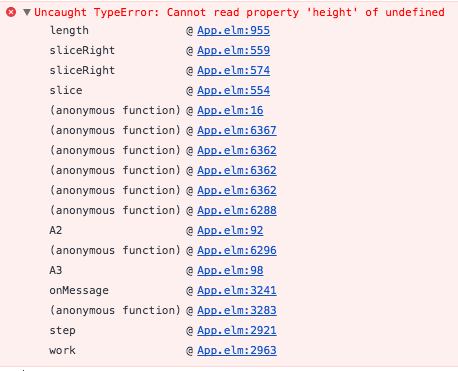

友人に頼まれてjQueryとUnderscore.jsで昔実装した
[東方キャラ選び](https://mt-caret.github.io/th/)を勉強がてらElmで組みなおして
みようと思い立ったものの、`_.sample`に相当するものが存在しなかったため、
`_.sample`に必要な`_.shuffle`をElmで実装してみました。

<!---->

これで色々遊んでいたらランタイムエラーが出ない事が売りのElmでこんなものが
でました。

[coreのArray実装に問題があるようです。](https://github.com/elm-lang/core/issues/649)

